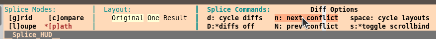

## Splice9

`Splice9` plugin for resolving three-way merges; it runs on `Vim9.1`.
<br>It's inspired by Adobe Lightroom's user interface. 
<br>[Watch the demo screencast](http://vimeo.com/25764692)

`Splice9` is pure `vim9script` port of Steve Losh's [Splice](https://github.com/sjl/splice.vim) which is a vimscript/python hybrid.

In vim do `:he Splice`. **Recommended at least once**.

See [Dynamic HUD](#dynamic-hud) below for a description of new features in `Splice9`.

Typically Splice9 is started by your VCS. When it starts up, you can do

1. `cycle diffs`
2. `next conflict`
3. `use hunk` to put the chosen hunk into the `Result` file
4. edit `Result` as needed
5. Either `save-quit` or `error-exit` to abort the merge

Try chosing the different `modes` and doing `cycle layouts` and `cycle diffs`;
see the various ways the files and diffs are displayed.

## VCS Support

- [Mercurial](#mercurial)
- [Git](#git)
- [Bazaar](#bazaar)

Once you've installed Splice you'll need to configure your version control system to use it as a merge tool.

In the `vim` startup arguments, you can do addional things such as setting the width with `-c "set
columns=220"`.

### Mercurial

Add the following lines to `~/.hgrc`:

```
[merge-tools]
splice.executable = gvim
splice.args = -f $base $local $other $output -c 'Splice9Init'
splice.premerge = keep
splice.priority = 1
```

**Note:** replace gvim with mvim if you're on Mac, or just plain vim if you prefer to keep the editor in the console.

### Git

Add the following lines to `~/.gitconfig`:

```
[merge]
tool = splice

[mergetool "splice"]
cmd = "gvim -f $BASE $LOCAL $REMOTE $MERGED -c 'Splice9Init'"
trustExitCode = true
```

**Note:** replace gvim with mvim if you're on Mac, or just plain vim if you prefer to keep the editor in the console.

### Bazaar

For Bazaar 2.4 or greater, add the following line to bazaar.conf:

```
bzr.mergetool.splice = gvim {base} {this} {other} {result} -c 'Splice9Init'
```

Optionally, change the default merge tool by setting:

```
bzr.default_mergetool = splice
```

For earlier versions of Bazaar, set the following entry in bazaar.conf:

```
external_merge = gvim %b %t %o %r -c 'Splice9Init'
```

**Note:** replace gvim with mvim if you're on Mac, or just plain vim if you prefer to keep the editor in the console.

## Dynamic HUD

Some of the Splice9 UI enhancements:
- Additional status info (compact) in the HUD (Heads Up Display).<br>
- The action buttons in the HUD are clickable.
- Rollover highlight for active HUD buttons.
- Click for popup of shortcuts.
- Can specify each action's ":map"/shortcut individually.
- Can set "use meta" and the meta key is used instead of using g:mapleader.
- Version control system configuration the same as original Splice. 

<!--
  See [HUD](https://github.com/errael/splice9/wiki/HUD) for a description of the new features.
-->

**Heads Up Display**

This page describes capability/status available in the `Splice9 HUD` that is not available in the original Splice. In `vim` do `:help splice` to learn about the `HUD`.

Here is the left part of the `HUD` which illustrates the additional status.



Much of the `Splice9 HUD` is active. The active items are in `bold`. When the cursor moves over an active command it is highlighted. `n: next conflict` in the image shows this highlighting. When an active command is highlighted, press the mouse button to execute the command. Note that there are keyboard shortcuts for all the commands.

#### Splice Modes:

This region shows the current mode; `*[p]ath` in this example is highlighted. The modes act as commands, click on a mode and that mode is entered. Each mode has it's own set of layouts available.

#### Layout:

This region shows the arrangement of the open windows and which file/buffer is loaded into the window. When `Splice9` is diffing files, the files participating in the diff are highlighted; they are `Original` and `One` in this example.

#### Splice Commands:

The label of this region, `Splice Commands:`, is active. Click on it to display a popup which has each command with its associated keyboard shortcut.

The command `D: diffs off` has embedded status information. When `Splice9` is diffing files there is a `*` displayed after the `D:`; this is shown in the image above. When the `*` is displayed, clicking on this command (or using the shortcut), turns off diffing.

The command `s: toggle scrollbind` also has a `*` indicator; it means that `scrollbind` is on. Note that `scrollbind` automatically goes on when diffing, the files that participate in the diff are in `scrollbind`. When not diffing, click on `scrollbind` so displayed files scroll together.


**Following is TODO**

## configuration

